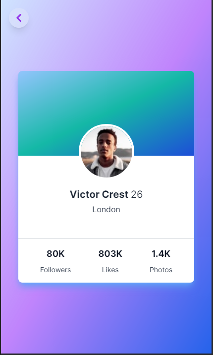
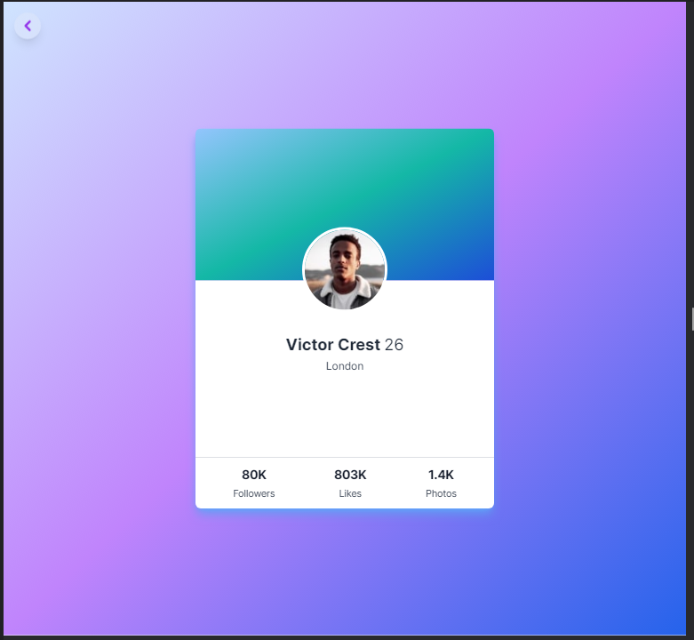

# congenial-palm-tree

Frontend challenges

## About

I would be sharpening my skill in frontend dev by creating/recreating new/some projects. Particularly, i would be using my favourite stacks:

- React Js, [reactjs.org](https://reactjs.org/)
- Tailwind CSS, [tailwindcss.com](https://tailwindcss.com/)

### Challenge 1 - Profile Card componemts

What they ordered:

Vs what they got:

Check the live code [here](https://congenial-palm-tree.vercel.app/profile).
